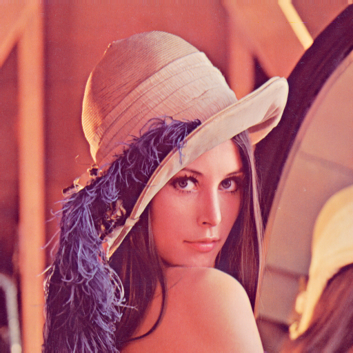

# 实验结果记录

## 1, 2题

量化因子 图片大小 压缩比 信噪比
<!-- - 0.5 64x64x3 11.3896 37.7779
- 2 64x64x3 25.5401   34.7565
- 5 64x64x3 46.5455  27.9586 -->

- 0.5 128x128x3 6.9888 35.3438
- 3   128x128x3 13.9275 33.6697
- 10  128x128x3 21.4684 32.5045

- 0.5 256x256x3  9.2040 40.8424
- 3   256x256x3  17.5853 33.8889
- 10  256x256x3 25.0189  30.0513

- 0.5 512x512x3 7.8405 35.8248 
- 3 512x512x3  17.3444 33.1444 
- 10 512x512x3 25.4035 29.7977

灰度图

- 3 367x380x3 14.1907 34.9953
- 3 367x380x3 14.1907 34.9953
- 3 367x380x3 14.1907 34.9953

## 结果分析

问题 1 

我们根据之前所述模型，对一些图进行了有损压缩测试。
以下是128x128x3的图片，分别是选择了原图，0.5，3，10的量化因子的效果

以下是256x256x3的图片，分别是选择了原图，0.5，3，10的量化因子的效果

以下是512x512x3的图片，分别是选择了原图，0.5，3，10的量化因子的效果

